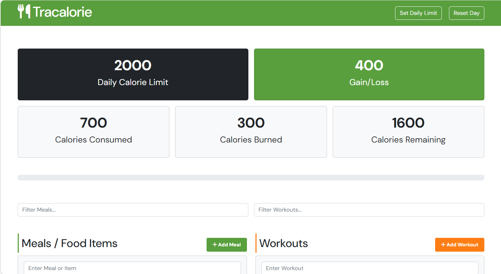

# 🔥 Tracalorie

A calorie tracking app built with **Vanilla JavaScript**. Log meals and workouts, track your daily calorie balance, and persist data across sessions — all without a framework.



---

## Features

- 🍽️ Add and delete meals with calorie values
- 🏋️ Add and delete workouts with calories burned
- 📊 Live calorie summary — consumed, burned, and net balance
- 💾 Persistent data via `localStorage`
- 🔄 Reset the day with a single click

---

## Tech Stack

- HTML5 / CSS3
- Vanilla JavaScript (ES6+)
- [Bootstrap 5](https://getbootstrap.com) — utility-first styling
- Font Awesome — icons

---

## Getting Started

### 1. Clone the repository

```bash
git clone https://github.com/massa-ngl/tracalorie.git
cd tracalorie
```

### 2. Run the app

Open `index.html` in your browser directly, or use a local server (recommended):

```bash
# With VS Code Live Server, or:
npx serve .
```

No build step or API key required — the app runs entirely in the browser.

---

## Project Structure

```
tracalorie/
├── css/
│   ├── bootstrap.css
│   ├── fontawesome.css
│   └── style.css
├── images/
│   └── screenshots/
│       ├── project_diagram.png
│       └── screen.png
├── js/
│   ├── app.js
│   └── bootstrap.bundle.min.js
├── favicon.ico
├── index.html
├── LICENSE
└── README.md
```

---

## Notes

- **localStorage:** Data persists between page refreshes but is tied to the browser. Clearing site data will reset the tracker.
- This project follows an **OOP architecture** — calorie tracking logic, UI rendering, and storage are separated into distinct classes.
- No external APIs are used; everything runs client-side.

---

## Credits

- Project inspired by Brad Traversy's *Modern JavaScript From The Beginning 2.0* course